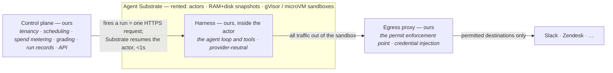
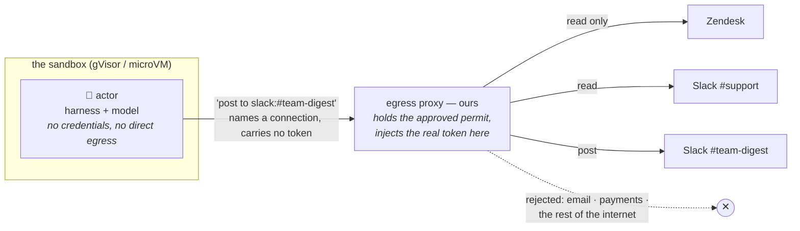

> Historical (2026-08-31): the Substrate thread was closed by the pivot to
> customer-deployed Tomte — see
> [the pivot spec](../superpowers/specs/2026-08-31-tomte-pivot-design.md).
> Kept as a record of the hosted-era analysis.

# How Nightshift runs while everyone sleeps

**Technical briefing for leadership review · August 2026**

Nightshift only works if people trust it enough to let it run overnight against
their real systems. Getting there takes two bets: **put the safety boundary
somewhere the agent can't touch it**, and **run on compute where an idle agent
costs almost nothing beyond storage** — and idle is almost always. (The fleet
itself is still a standing bill; see the risks.) Agent Substrate is the second
bet. The first is entirely our own code.

## 1. What we rent, what we build

Substrate is an open-source compute layer: sandboxed "actors" whose memory can
be frozen and thawed cheaply, packed many-to-a-worker. That's all it does — no
budgets, no credentials, no schedules, no quality checks. Which suits us fine:
the layers customers actually pay for are the ones we keep.

That leaves eight governance pieces for us to build: permits, grading, spend
caps, scheduling, credential vaulting, run records, tool permissions,
versioning. A managed-agents platform would have given us most of that for free
— but it replaces Substrate rather than sitting on it, ties us to one vendor,
and takes the margin that multiplexing creates. We'd rather build the
governance and keep the economics.

## 2. The economics of a sleeping agent

A weekly digest does about four minutes of work and then nothing for a week.
Normally you'd pay for the week anyway. Substrate snapshots the actor's RAM and
files, parks it, and wakes it in under a second when our scheduler knocks — so
one worker carries around thirty sleeping workflows instead of one.

| ~99.9%                | <1 s                  | ~30×                   |
| --------------------- | --------------------- | ---------------------- |
| of its life suspended | resume, memory intact | idle actors per worker |

The sleep trick also buys a better product: the workflow keeps its memory
between Mondays. It can say **"this login complaint is up for the third week
running"** because it's the same actor waking up — not a fresh process we had
to bolt a memory system onto.

## 3. Making "cannot go beyond this line" literally true

The approval screen tells the user "it cannot go beyond this line." We have to
make that literally true, and we can't do it inside the sandbox — the
enforcement code would live right next to the model it's policing. So **actors
get no internet access at all**. Everything goes out through a proxy we run,
and the proxy holds the approved permit.

Customer credentials never enter the sandbox. The only component that ever sees
a token sits outside the blast radius — which is what makes the approval screen
honest.

Substrate's own network rules are per pool of workers — too blunt to say "this
workflow gets Slack, that one gets Zendesk." So the proxy is the real control,
with pool-level default-deny as a backstop. If Substrate ships per-actor rules
later, good: we'll have two locks.

## 4. Why not just run an agent on the desktop?

A desktop agent — Claude on a laptop, a browser assistant — can do this work
today. What it can't do is be _left alone_ with it. The gap isn't intelligence.
It's that a desktop agent runs as you, with your credentials, only while your
laptop is open.

|              | Desktop agent                                          | Nightshift on Substrate                                          |
| ------------ | ------------------------------------------------------ | ---------------------------------------------------------------- |
| Availability | Runs while the machine is awake and someone remembers. | Scheduler fires it at 3AM; nobody needs to be present, ever.     |
| Blast radius | Your full privileges — what you can click, it can.     | An approved allowlist, enforced at a proxy outside the sandbox.  |
| Credentials  | Live on the machine, inside the agent's reach.         | Never enter the sandbox; injected at the boundary per request.   |
| Spend        | Uncapped; noticed on the invoice.                      | Metered per run, checked before each model request.              |
| Quality      | Whatever the user happens to notice.                   | Every run graded against the user's rules; auto-pause after 3.   |
| Audit        | A chat scrollback on someone's laptop.                 | Run records pushed to the control plane, end to end.             |
| Isolation    | The user's own OS and session.                         | gVisor / microVM sandbox; tenant state reset pending validation. |
| Unit cost    | A whole machine and a human's attention per job.       | ~1/30th of a worker while idle, which is almost always.          |

> A desktop agent is a power tool for whoever's holding it. Nightshift is the
> same capability with the person removed — safe only because the boundary, the
> meter, and the grader don't live where the model does.

## 5. What could bite us

The open items worth weighing, and what we're doing about each.

- **Substrate is pre-1.0.** Its own docs say the APIs will change. So: every
  Substrate call goes through one narrow interface, and a boring Kubernetes
  Jobs backend ships alongside it from day one — a working fallback, not a
  promised one.
- **Per-workflow egress isn't native.** Substrate can't do per-workflow network
  rules yet. So: the proxy is the primary control, not a nice-to-have, and
  we're watching upstream in case per-actor rules land.
- **Grading doubles inference.** Checking every run against the user's rules is
  what makes "we'll come find you" honest — and it's a second model call per
  run. Open: we need a grader cost number before setting prices.
- **A fleet has a standing bill.** MicroVM-capable nodes cost money before
  customer #1. Open: the runway assumption should be explicit in the plan.
- **State reset between tenants.** Substrate flags suspend/resume cleanup as
  needing testing. We're hosting strangers' agents, so we test it ourselves
  before multi-tenant launch.

---

Sources: [`../superpowers/specs/2026-08-30-nightshift-platform-design.md`](../superpowers/specs/2026-08-30-nightshift-platform-design.md)
and [`../superpowers/specs/2026-08-28-nightshift-design.md`](../superpowers/specs/2026-08-28-nightshift-design.md).
Substrate facts were read from its README, architecture, and threat-model docs
on 2026-08-30; items marked open are unverified against source or a running
cluster.
